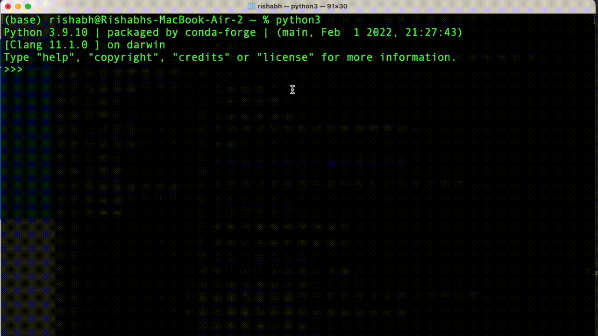

# TL;DR
Defog converts your natural language text queries into SQL and other machine readable code



# Installation
`pip install --upgrade defog`

# Getting your API Key
You can get your API key by going to [https://defog.ai/account](https://defog.ai/account) and creating an account.

# Usage

## Postgres
```
from defog import Defog

# your credentials are never sent to our server, and always run locally
defog = Defog(
    api_key="YOUR_API_KEY",
    db_type="postgres",
    db_creds={
        "host": YOUR_DB_HOST,
        "port": YOUR_PORT, # usually, this is 5432 for Postgres DBs
        "database": YOUR_DATABASE_NAME,
        "user": YOUR_USER_NAME, # often `defogdata`, if you have followed our setup instructions
        "password": YOUR_PASSWORD
    }
)

# generate a schema of your selected postgres tables
# feel free to make changes to the google sheet url generated
gsheets_url = defog.generate_postgres_schema(tables=['your_table_name_1', 'your_table_name_2']) 

# update the postgres schema in our database
defog.update_postgres_schema(gsheets_url)

question = "question asked by a user"
results = defog.run_query(
  question=question
)

print(results)
```

## Mongo
```
from defog import Defog

# your credentials are never sent to our server, and always run locally
defog = Defog(
    api_key="YOUR_API_KEY",
    db_type="mongo",
    db_creds={
        "connection_string": YOUR_CONNECTION_STRING,
    }
)

# generate a schema of your selected mongo collections
# feel free to make changes to the google sheet url generated
gsheets_url = defog.generate_mongo_schema(collections=['collection_name_1', 'collection_name_2'])

# update the postgres schema in our database
defog.update_mongo_schema(gsheets_url)

question = "question asked by a user"
results = defog.run_query(
  question=question
)

print(results)
```

## MySQL
```
from defog import Defog

# your credentials are never sent to our server, and always run locally
defog = Defog(
    api_key="YOUR_API_KEY",
    db_type="mysql",
    db_creds={
        "host": YOUR_DB_HOST,
        "database": YOUR_DATABASE_NAME,
        "user": YOUR_USER_NAME, # often `defogdata`, if you have followed our setup instructions
        "password": YOUR_PASSWORD
    }
)

# generate a schema of your selected postgres tables
# feel free to make changes to the google sheet url generated
gsheets_url = defog.generate_mysql_schema(tables=['your_table_name_1', 'your_table_name_2']) 

# update the mysql schema in our database
defog.update_mysql_schema(gsheets_url)

question = "question asked by a user"
results = defog.run_query(
  question=question
)

print(results)
```


## BigQuery
```
from defog import Defog

# your credentials are never sent to our server, and always run locally
defog = Defog(
    api_key="YOUR_API_KEY",
    db_type="bigquery",
    db_creds="/path/to/service/json.key",
)

# generate a schema of your selected Bigquery tables
# feel free to make changes to the google sheet url generated
gsheets_url = defog.generate_bigquery_schema(tables=['your_table_name_1', 'your_table_name_2'])

# update the postgres schema in our database
defog.update_biguery_schema(gsheets_url)

question = "question asked by a user"
results = defog.run_query(
  question=question
)

print(results)
```

## Redshift
```
from defog import Defog

# your credentials are never sent to our server, and always run locally
defog = Defog(
    api_key="YOUR_API_KEY",
    db_type="redshift",
    db_creds={
        "host": YOUR_DB_HOST,
        "port": YOUR_PORT, # usually, this is 5439 for Redshift
        "database": YOUR_DATABASE_NAME,
        "user": YOUR_USER_NAME, # often `defogdata`, if you have followed our setup instructions
        "password": YOUR_PASSWORD
    }
)

# generate a schema of your selected Redshift tables
# feel free to make changes to the google sheet url generated
gsheets_url = defog.generate_redshift_schema(tables=['your_table_name_1', 'your_table_name_2']) 

# update the redshift schema in our database
defog.update_redshift_schema(gsheets_url)

question = "question asked by a user"
results = defog.run_query(
  question=question
)

print(results)
```

## Snowflake
```
from defog import Defog

# your credentials are never sent to our server, and always run locally
defog = Defog(
    api_key="YOUR_API_KEY",
    db_type="snowflake",
    db_creds={
        "user": YOUR_USER_NAME,
        "password": YOUR_PASSWORD,
        "account": YOUR_ACCOUNT_NAME,
        "warehouse": YOUR_WAREHOUSE_NAME
        
    }
)

# generate a schema of your selected Snowflake tables
# feel free to make changes to the google sheet url generated
tables_to_query = ['your_table_name_1', 'your_table_name_2']
gsheets_url = defog.generate_snowflake_schema(tables=tables_to_query)

# update the snowflake schema in our database
defog.update_snowflake_schema(gsheets_url)

question = "question asked by a user"
results = defog.run_query(
  question=question
)

print(results)
```